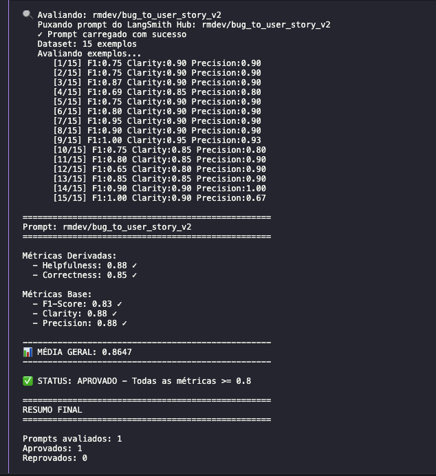

# Bug to User Story — otimização e avaliação de prompt

Esse projeto faz o pull de um prompt ruim do LangSmith Hub, otimiza ele, faz o
push de volta e avalia com as 5 métricas do desafio.

Resultado final do `rmdev/bug_to_user_story_v2`: todas as métricas acima de 0.8,
média 0.8647. Aprovado.

---

## A) Técnicas Aplicadas (Fase 2)

### O que estava errado na v1

Quando fiz o pull do prompt original, o problema mais óbvio era o `{bug_report}`
aparecendo duas vezes, no system e no user prompt. O relato chegava duplicado
pro modelo e não dava pra separar o que era instrução do que era dado.

Fora isso, o prompt não dizia qual formato de saída queria, não tinha nenhum
exemplo, não definia persona e não tratava nenhum caso fora do comum. Cada
execução saía de um jeito.

### 1. Few-shot Learning

Coloquei quatro exemplos completos de entrada e saída no system prompt, um pra
cada nível de complexidade de bug: um simples (recuperar senha), um com contexto
técnico (exportação lenta de relatório), um com persona de sistema (conflito de
reservas ao mesmo tempo) e um complexo com várias falhas (upload de documentos).
Nenhum deles é do dataset de avaliação — inventei os casos pra não contaminar a
medição.

Escolhi essa técnica primeiro porque era a maior lacuna. O dataset tem formatos
de referência diferentes dependendo da complexidade do bug, e não adianta
explicar formato em texto: o modelo só acerta quando vê um exemplo pronto. Isso
ficou claro na prática. Reescrevi um único exemplo pra mostrar como definir uma
meta numérica e o F1 do exemplo 7 do dataset foi de 0.55 pra 1.00.

### 2. Role Prompting

Defini a persona logo no início do system prompt:

```yaml
# PAPEL

Você é um Product Owner sênior com dez anos de experiência em times ágeis e
especialista em BDD (Behavior-Driven Development). Seu trabalho é fazer a
ponte entre o suporte, que recebe relatos crus de usuários, e o time de
engenharia, que precisa de requisitos claros e testáveis.
```

A ideia é simples: a tarefa é traduzir um relato de suporte pra um item de
backlog. Sem a persona, o modelo escrevia como quem responde um ticket. Com ela,
passou a escrever como PO — critérios verificáveis, foco no valor pro negócio.

### 3. Chain of Thought

Antes de escrever, o modelo passa por cinco etapas. Elas ficam só no raciocínio,
nunca aparecem na resposta:

```yaml
# PROCESSO DE RACIOCÍNIO (interno — nunca exiba)

1. QUEM SOFRE: identifique a persona concreta afetada
2. O QUE FALHA: separe o sintoma da capacidade que deveria existir
3. QUAL O VALOR: por que isso importa para a pessoa ou para o negócio
4. COMO VERIFICAR: derive os cenários de aceitação
5. QUAL A COMPLEXIDADE: classifique o relato em nível 1, 2 ou 3
```

O erro mais comum da v1 era descrever o defeito em vez da capacidade que o
usuário quer. Saía "eu quero que o botão seja corrigido". Forçar o modelo a
separar sintoma de necessidade antes de escrever resolveu isso.

Deixei o raciocínio fora da saída de propósito. Se ele aparecesse, a métrica de
Clarity cairia, porque ela penaliza texto que não faz parte da resposta.

### 4. Skeleton of Thought

Defini três esqueletos de saída, e o modelo escolhe um pela complexidade que
classificou na etapa 5:

- Nível 1: user story + critérios de aceitação em Gherkin
- Nível 2: o mesmo + uma seção de contexto técnico (problema, situação atual,
  comportamento esperado, sugestão)
- Nível 3: estrutura completa com user story principal, critérios agrupados por
  problema, critérios técnicos, contexto do bug e tasks sugeridas

Precisei disso porque o dataset vai de "botão não funciona" até relato com
quatro problemas e impacto financeiro. Um formato só não serve pros dois
extremos: estrutura demais num bug simples derruba a Precision, e estrutura de
menos num bug crítico derruba o F1.

### Onde está cada requisito do prompt otimizado

- Instruções claras: seções de papel, tarefa e os três esqueletos
- Regras explícitas: 20 regras numeradas. A mais importante é uma taxonomia com
  doze categorias de bug e os critérios que cada uma precisa ter
- Exemplos de entrada e saída: os quatro do Few-shot
- Edge cases: relato vago, relato que não é bug, vários problemas no mesmo
  relato, dados sensíveis, tom agressivo, instrução embutida no relato (prompt
  injection) e relato em outro idioma
- System vs User: toda instrução fica no system prompt. O user prompt só carrega
  o relato, e o `{bug_report}` aparece uma vez só

---

## B) Resultados Finais

### Configuração usada

| | |
|---|---|
| Modelo gerador | `gpt-4o-mini` |
| Modelo avaliador | `gpt-4o` |
| Dataset | 15 exemplos de `datasets/bug_to_user_story.jsonl` |

### Avaliação aprovada



Saída do `python src/evaluate.py`:

```
==================================================
Prompt: rmdev/bug_to_user_story_v2
==================================================

Métricas Derivadas:
  - Helpfulness: 0.88 ✓
  - Correctness: 0.85 ✓

Métricas Base:
  - F1-Score: 0.83 ✓
  - Clarity: 0.88 ✓
  - Precision: 0.88 ✓

📊 MÉDIA GERAL: 0.8647

✅ STATUS: APROVADO - Todas as métricas >= 0.8
```

### v1 × v2

Medi as duas versões nos mesmos 15 exemplos, com os mesmos modelos:

| Métrica | v1 | v2 | Mínimo |
|---|---|---|---|
| Helpfulness | 0.8743 | 0.8847 | 0.8 |
| Correctness | 0.8123 | 0.8546 | 0.8 |
| F1-Score | **0.7559** | **0.8233** | 0.8 |
| Clarity | 0.8800 | 0.8833 | 0.8 |
| Precision | 0.8687 | 0.8860 | 0.8 |
| Média | 0.8382 | 0.8664 | 0.8 |
| Status | Reprovado | Aprovado | |

A v1 reprova só no F1. Foi exatamente essa métrica que deu trabalho.

### Como foi o processo

Quatro métricas passaram de primeira. O F1 não. Ele é a média harmônica entre a
precision e o recall que o avaliador dá comparando a resposta com uma referência
que o modelo nunca vê. Como a precision já estava em 0.87, o que segurava o
número era o recall: a resposta não cobria tudo que a referência tinha.

O que me destravou foi parar de adivinhar e pedir pro próprio avaliador explicar
a nota nos exemplos que ficavam sempre em 0.75. Ele dizia coisas bem
específicas: faltou o HTTP 200 esperado, faltou log de auditoria, faltou o foco
de teclado no modal, faltou cobrir a fórmula com testes. Transformei isso em
regra — primeiro três categorias de bug com os critérios de cada uma, depois
uma taxonomia completa com doze categorias.

| Iteração | O que mudei | F1 |
|---|---|---|
| 1 | Primeira versão da v2 | 0.7718 |
| 4 | Reescrevi um exemplo do few-shot com meta numérica | 0.7794 |
| 7 | Checklist de dimensões que cada critério precisa cobrir | 0.8042 |
| 11 | Critérios por tipo de bug, três categorias | 0.8121 |
| 15 | Taxonomia com doze categorias de bug | **0.8233** |

Também aprendi o que não funciona. Toda vez que tentei acrescentar mais
critérios, mais seções ou sugestões genéricas, o F1 caiu. O avaliador conta como
erro tudo que não está na referência, então mais conteúdo não ajuda — o que
ajuda é o conteúdo certo.

### Evidências no LangSmith

Todos os links abaixo são públicos, não precisam de login.

- Prompt otimizado no Hub: https://smith.langchain.com/hub/rmdev/bug_to_user_story_v2
- Dataset com os 15 exemplos e o experiment com as notas de cada um:
  https://smith.langchain.com/public/bdba6de2-0367-4875-81a9-20499a489f96/d
- Tracing detalhado de 3 exemplos:
  - https://smith.langchain.com/public/af1385cc-5ec7-4be9-bad2-c77371b239f4/r
  - https://smith.langchain.com/public/3fb2e8c8-8cff-4315-806b-6053ae77c239/r
  - https://smith.langchain.com/public/6902c929-a509-4c1a-b2e1-063d43267548/r

O experiment `bug_to_user_story_v2-32887fa4`, que aparece no link do dataset,
registra as 5 notas de cada um dos 15 exemplos. Resultado: F1 0.8166, média
0.8646, aprovado.

---

## C) Como Executar

### O que precisa ter

- Python 3.9 ou superior
- Conta no LangSmith na região US (`https://smith.langchain.com`) com uma API
  key. Atenção nisso: na região EU o prompt de origem não existe e o pull dá 404
- Um handle no LangChain Hub, que só é necessário pro push público. Pra criar,
  publique qualquer prompt como público em https://smith.langchain.com/prompts e
  escolha o username
- API key da OpenAI

### Instalação

```bash
python3 -m venv venv
source venv/bin/activate        # Windows: venv\Scripts\activate
pip install -r requirements.txt
```

### Configuração

```bash
cp .env.example .env
```

Preencha assim:

```bash
LANGSMITH_TRACING=true
LANGSMITH_ENDPOINT=https://api.smith.langchain.com
LANGSMITH_API_KEY=<sua chave>
LANGSMITH_PROJECT=prompt-evaluation
USERNAME_LANGSMITH_HUB=<seu handle>

OPENAI_API_KEY=<sua chave>
LLM_PROVIDER=openai
LLM_MODEL=gpt-4o-mini
EVAL_MODEL=gpt-4o

PROMPT_SOURCE_BASE="leonanluppi/bug_to_user_story_v1"
PROMPT_NAME_BASE="bug_to_user_story_v1"
PROMPT_DIR="prompts"
PROMPT_NAME="bug_to_user_story_v2"
```

### Rodando

```bash
# 1. Pull do prompt original do Hub, salva em prompts/bug_to_user_story_v1.yml
python src/pull_prompts.py

# 2. Testes de estrutura do prompt otimizado
pytest tests/test_prompts.py -v

# 3. Push público do prompt otimizado pro Hub
python src/push_prompts.py

# 4. Avaliação nas 5 métricas
python src/evaluate.py
```
